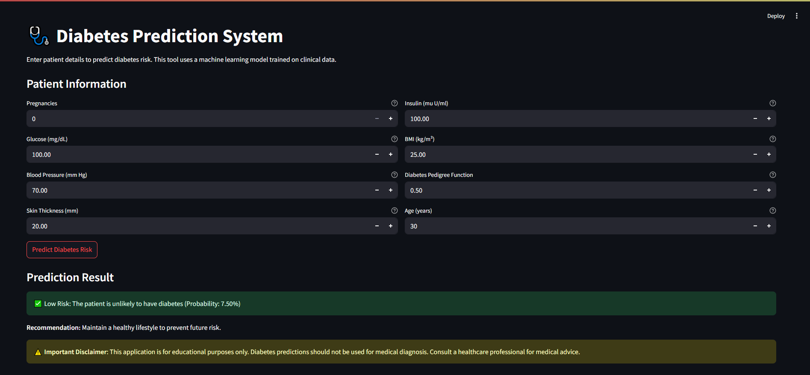

# 📈 Diabetes Prediction Project

## Project Overview

This project focuses on predicting diabetes using machine learning techniques. It includes a comprehensive analysis notebook for diabetes prediction, featuring data exploration, feature engineering, visualizations, and model evaluation. Additionally, it provides placeholders for interactive Streamlit and Flask web applications to enable real-time predictions and insights.

## 📊 Dataset

The dataset used is the Diabetes Dataset from Kaggle, containing 2000 rows and 9 columns with the following features:

* **Pregnancies**
* **Glucose**
* **BloodPressure**
* **SkinThickness**
* **Insulin**
* **BMI**
* **DiabetesPedigreeFunction**
* **Age**
* **Outcome** (target variable: 0 for no diabetes, 1 for diabetes)

## Preprocessing

### Zero Value Handling

Zero values in Glucose, BloodPressure, SkinThickness, Insulin, and BMI are replaced with their respective medians.

### Feature Engineering

* Categorical features created:

  * `BMI_Category` (Underweight, Normal, Overweight, Obese)
  * `Glucose_Level` (Normal, Prediabetes, Diabetes)
  * `Age_Group` (Young, Middle, Senior, Elderly)
* Log transformations applied to skewed features: `Insulin` and `DiabetesPedigreeFunction`

### Encoding

Categorical features are one-hot encoded.

### Scaling

Numerical features are scaled using `StandardScaler`.

## 📁 Project Structure

```bash
Diabetes_Prediction/
├── dataset/
│   └── diabetes.csv                  # Diabetes dataset
├── models/
│   ├── diabetes_model.pkl           # Trained Random Forest model (if saved)
│   ├── scaler.pkl                   # StandardScaler object
│   └── feature_names.pkl            # Feature names (if saved)
├── plots/                           # Generated visualizations (e.g., PNGs)
├── templates/                       # HTML templates for Flask app
├── Diabetes_Prediction.ipynb        # Main Jupyter notebook for diabetes prediction
├── flask_app.py                     # Flask app for serving predictions
├── stapp.py                         # Streamlit app for interactive visualization
├── requirements.txt                 # Dependencies for the project
└── README.md                        # Project overview and instructions
```

## 🚀 Getting Started

### Prerequisites

* Python 3.8+
* pip

### Installation

```bash
git clone <repository-url>
cd Diabetes_Prediction
pip install -r requirements.txt
```

### Running the Streamlit App

```bash
streamlit run stapp.py
```

This will launch an interactive web application (placeholder) where you can:

* Explore visualizations of the dataset.
* View model performance metrics.
* (Future) Input data for real-time diabetes predictions.

### Running the Flask App

```bash
python flask_app.py
```

This will start a Flask server (placeholder) for serving model predictions via a web interface or API.

## 🤖 Machine Learning Models

The following models are implemented for diabetes prediction:

* **Random Forest**: Tuned with `n_estimators` (100, 200) and `max_depth` (5, 10, None)
* **Gradient Boosting**: Tuned with `n_estimators` (100, 200) and `learning_rate` (0.01, 0.1)
* **Logistic Regression**: Tuned with `C` (0.1, 1, 10)
* **SVM**: Tuned with `C` (0.1, 1, 10) and `kernel` (rbf, linear)

### Evaluation Metrics

* Accuracy
* Precision, Recall, F1-Score (for the positive class)
* ROC AUC

### Model Saving

* Best Random Forest model saved as `diabetes_model.pkl`
* `StandardScaler` object saved as `scaler.pkl`
* Feature names saved as `feature_names.pkl` *(ensure feature\_names is defined)*

## 📊 Visualizations

Visualizations are saved in the `plots/` directory:

* **Correlation Heatmap**: Shows correlations between numerical features.
* **Glucose Distribution by Outcome**: Boxplot of glucose levels by diabetes outcome.
* **BMI Category Distribution**: Count plot of BMI categories by outcome.
* **Age Distribution by Outcome**: Stacked histogram of age by outcome.
* **Feature Distributions**: KDE plots for numerical features by outcome.
* **Confusion Matrices**: For each model, showing true vs. predicted labels.
* **ROC Curves**: For each model, displaying ROC AUC.

## ⚠️ Important Disclaimer

This application is for **educational purposes only**. Diabetes predictions should not be used for medical diagnosis. Consult a healthcare professional for medical advice.

## 🛠️ Technical Implementation

* **Data Exploration**: Checks for missing values, duplicates, and zero values; provides dataset info and summary statistics.
* **Feature Engineering**: Creates categorical and log-transformed features for better model performance.
* **Preprocessing**: Applies one-hot encoding and standard scaling.
* **Model Training**: Uses GridSearchCV for hyperparameter tuning and evaluates models with cross-validation.
* **Visualization**: Utilizes Seaborn and Matplotlib for static plots, with potential for Plotly in web apps.

## 📜 Requirements

```text
pandas>=1.3.0
numpy>=1.20.0
matplotlib>=3.4.0
seaborn>=0.11.0
scikit-learn>=1.0.0
streamlit>=1.10.0
flask>=2.0.0
```

## 📃 Future Improvements

* Implement additional models (e.g., XGBoost, neural networks) for diabetes prediction.
* Add feature importance analysis for trained models.
* Enhance Streamlit and Flask apps with real-time prediction capabilities.
* Include interactive Plotly visualizations in the web apps.
* Fix potential bug in saving `feature_names.pkl` (ensure `feature_names` is defined).

## 📜 License

This project is open source and available under the MIT License.

## 🙏 Acknowledgements

* **Dataset**: Diabetes Dataset from Kaggle.
* **Author**: Sajjad Ali Shah ([LinkedIn](https://www.linkedin.com))
* **Inspiration**: Data science communities and tools like Jupyter, Flask, and Streamlit.
