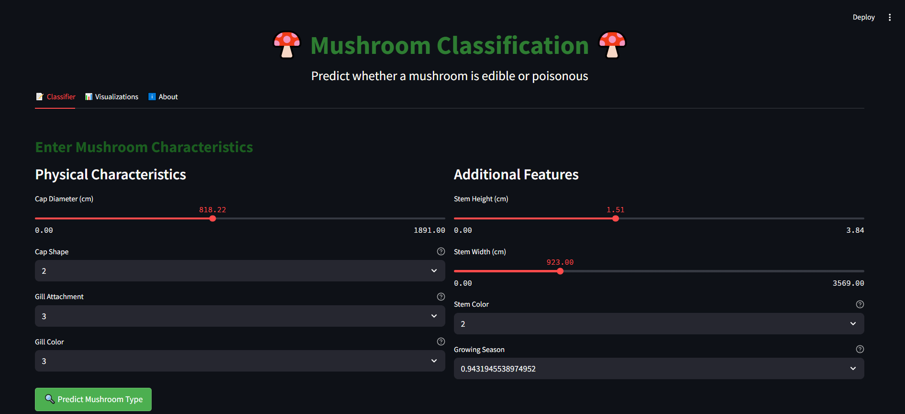
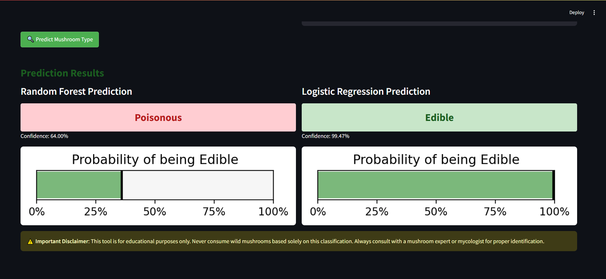

# 🍄 Mushroom Classification Project

## Project Overview
This project uses machine learning to classify mushrooms as edible or poisonous based on their physical characteristics. It includes a comprehensive analysis notebook and an interactive Streamlit web application for real-time predictions.

## 📊 Dataset
The dataset (`mushroom_cleaned.csv`) contains information about various mushroom species with features including:
- Cap diameter
- Cap shape
- Gill attachment
- Gill color
- Stem height
- Stem width
- Stem color
- Season

## 📁 Project Structure
```
mushroom_classifier_flask/
├── app.py                          # Main Flask application script
├── dataset/                        # Directory for the dataset
│   └── mushroom_cleaned.csv        # Preprocessed dataset
├── images/                         # Directory for static images (optional)
├── models/                         # Directory for saved models and scalers
│   ├── feature_names.joblib
│   ├── gradient_boosting_model.joblib
│   ├── k_nearest_neighbors_model.joblib
│   ├── logistic_regression_model.joblib
│   ├── random_forest_model.joblib
│   └── standard_scaler1.joblib
├── static/                         # Directory for static assets
│   ├── css/
│   │   └── styles.css              # Custom CSS for styling
│   ├── js/
│   │   └── scripts.js              # JavaScript for interactivity
├── templates/                      # Directory for HTML templates
│   ├── about.html
│   ├── base.html
│   ├── index.html
│   └── visualizations.html
├── Mushroom.ipynb                  # Jupyter notebook for EDA & modeling
├── requirements.txt                # Dependencies for the project
├── README.md                       # Project overview and instructions
├── class_distribution.png          # Visualization image (optional)
├── numerical_distributions.png     # Visualization image (optional)
├── numerical_boxplots_by_class.png # Visualization image (optional)
├── correlation_heatmap.png         # Visualization image (optional)
├── model_accuracy_comparison.png   # Visualization image (optional)
├── confusion_matrix_random_forest.png # Visualization image (optional)
├── confusion_matrix_logistic_regression.png # Visualization image (optional)

```


## 🚀 Getting Started

### Prerequisites
- Python 3.8+
- pip

### Installation
1. Clone the repository
```bash
git clone <repository-url>
cd mushroom-classification
```

2. Install the required packages
```bash
pip install -r requirements.txt
```

### Running the Streamlit App
```bash
streamlit run stapp.py
```
This will launch the interactive web application where you can:
- Input mushroom characteristics
- Get real-time predictions
- Explore visualizations of the data and model performance

## 🤖 Machine Learning Models
The following models were trained and evaluated:
- Random Forest (best performer)
- Logistic Regression
- Gradient Boosting
- K-Nearest Neighbors

## 📊 Visualizations
The project includes various visualizations:
- Distribution of mushroom classes
- Feature distributions by class
- Boxplots of numerical features
- Correlation heatmap
- Model performance comparison
- Confusion matrices

## ⚠️ Important Disclaimer
This application is for educational purposes only. Never consume wild mushrooms based solely on this classification. Always consult with a mushroom expert or mycologist for proper identification.

## 🛠️ Technical Implementation
- **Feature Engineering**: One-hot encoding for categorical features
- **Outlier Handling**: Z-score based capping of extreme values
- **Model Training**: Cross-validation and hyperparameter tuning
- **Model Serialization**: Saving models using joblib
- **Feature Consistency**: Saving and loading feature names to ensure prediction consistency

## 📋 Requirements
```
pandas>=1.3.0
numpy>=1.20.0
matplotlib>=3.4.0
seaborn>=0.11.0
scikit-learn>=1.0.0
streamlit>=1.10.0
joblib>=1.0.0
scipy>=1.7.0
Pillow>=8.0.0
```

## 📑 Future Improvements
- Add more advanced models like XGBoost or neural networks
- Implement feature importance analysis
- Add more detailed mushroom information and images
- Expand dataset with more examples and features

## 📜 License
This project is open source and available under the [MIT License](LICENSE).

## 🙏 Acknowledgements
- Inspired by real-world applications in mycology and food safety